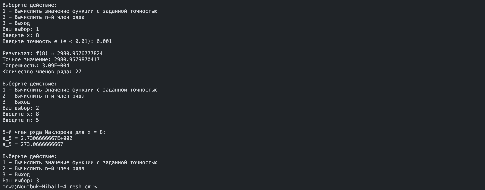
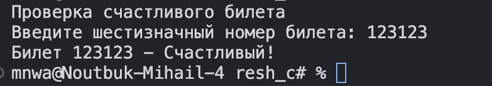
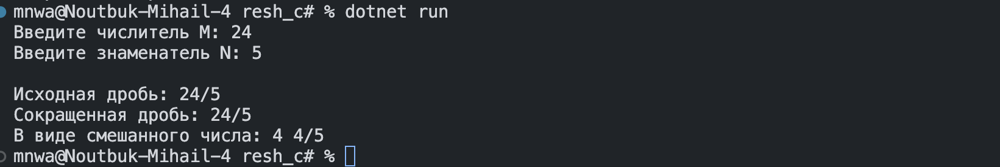
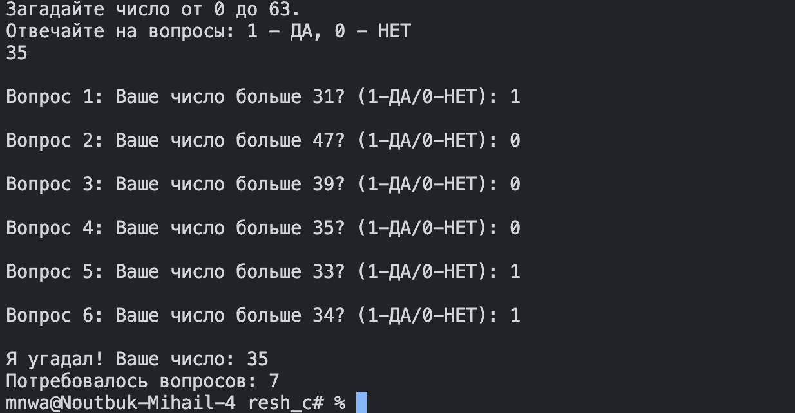
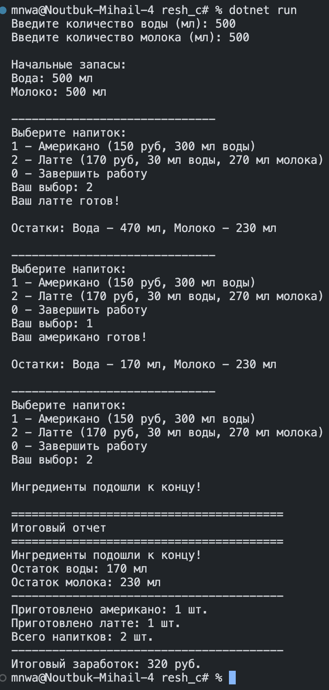
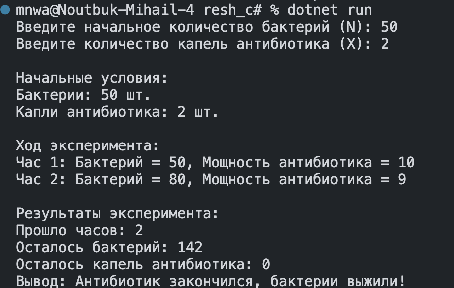
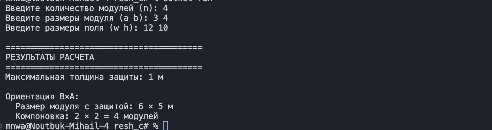

```csharp
using System;

namespace TaylorSeries
{
    class Program
    {
        // Главный метод программы - точка входа
        static void Main(string[] args)
        {
            // Бесконечный цикл для многократного использования программы
            while (true)
            {
                // Вывод меню выбора действий
                Console.WriteLine("\nВыберите действие:");
                Console.WriteLine("1 - Вычислить значение функции с заданной точностью");
                Console.WriteLine("2 - Вычислить n-й член ряда");
                Console.WriteLine("3 - Выход");
                
                Console.Write("Ваш выбор: ");
                string choice = Console.ReadLine(); // Чтение выбора пользователя
                
                // Обработка выбора пользователя
                switch (choice)
                {
                    case "1":
                        CalculateWithPrecision(); // Вызов метода вычисления с точностью
                        break;
                    case "2":
                        CalculateNthTerm(); // Вызов метода вычисления n-го члена
                        break;
                    case "3":
                        return; // Завершение программы
                    default:
                        Console.WriteLine("Неверный выбор. Попробуйте снова.");
                        break;
                }
            }
        }
        static double Function(double x)
        {
            return Math.Exp(x);
        }
        
        // n-й член ряда Маклорена для e^x 
        static double MaclaurinTerm(double x, int n)
        {
            // Формула n-го члена ряда Маклорена для e^x:
            // term = x^n / n!
            // где n! - факториал числа n
            return Math.Pow(x, n) / Factorial(n);
        }
        
        // Вычисление факториала числа
        static double Factorial(int n)
        {
            double result = 1;
            // Вычисление факториала: n! = 1 * 2 * 3 * ... * n
            for (int i = 2; i <= n; i++)
            {
                result *= i;
            }
            return result;
        }
        
        // Вычисление значения функции с заданной точностью
        static void CalculateWithPrecision()
        {
            try // Блок обработки исключений
            {
                // Ввод значения x
                Console.Write("Введите x: ");
                double x = double.Parse(Console.ReadLine());
                
                // Ввод точности вычислений
                Console.Write("Введите точность e (e < 0.01): ");
                double epsilon = double.Parse(Console.ReadLine());
                
                // Проверка корректности введенной точности
                if (epsilon >= 0.01)
                {
                    Console.WriteLine("Ошибка: точность должна быть меньше 0.01");
                    return; // Прерывание выполнения метода
                }
                
                double sum = 0;      // Сумма ряда (приближенное значение функции)
                double term;         // Текущий член ряда
                int n = 0;           // Счетчик членов ряда
                double exactValue = Function(x); // Точное значение функции (для сравнения)
        
                // Цикл вычисления суммы ряда до достижения заданной точности
                do
                {
                    term = MaclaurinTerm(x, n); // Вычисление текущего члена ряда
                    sum += term;                // Добавление члена к сумме
                    double error = Math.Abs(exactValue - sum); // Вычисление текущей погрешности
                    
                    n++; // Увеличение счетчика членов ряда
                    
                    // Защита от бесконечного цикла
                    if (n > 1000)
                    {
                        Console.WriteLine("Достигнуто максимальное количество итераций (1000)");
                        break; // Выход из цикла при превышении лимита итераций
                    }
                    
                } while (Math.Abs(term) > epsilon && n < 1000); // Условие продолжения цикла:
                // цикл выполняется пока модуль текущего члена больше точности
                // и не превышено максимальное количество итераций
                
                // Вывод результатов вычислений
                Console.WriteLine($"\nРезультат: f({x}) ≈ {sum:F10}");
                Console.WriteLine($"Точное значение: {exactValue:F10}");
                Console.WriteLine($"Погрешность: {Math.Abs(exactValue - sum):E2}");
                Console.WriteLine($"Количество членов ряда: {n}");
            }
            catch (FormatException) // Обработка ошибки неверного формата ввода
            {
                Console.WriteLine("Ошибка: неверный формат ввода");
            }
            catch (Exception ex) // Обработка всех остальных исключений
            {
                Console.WriteLine($"Ошибка: {ex.Message}");
            }
        }
        
        // Вычисление n-го члена ряда
        static void CalculateNthTerm()
        {
            try // Блок обработки исключений
            {
                // Ввод значения x
                Console.Write("Введите x: ");
                double x = double.Parse(Console.ReadLine());
                
                // Ввод номера члена ряда
                Console.Write("Введите n: ");
                int n = int.Parse(Console.ReadLine());
                
                // Проверка корректности введенного номера члена
                if (n < 0)
                {
                    Console.WriteLine("Ошибка: n должен быть неотрицательным");
                    return; // Прерывание выполнения метода
                }
                
                // Вычисление n-го члена ряда
                double term = MaclaurinTerm(x, n);
                
                // Вывод результата в двух форматах:
                Console.WriteLine($"\n{n}-й член ряда Маклорена для x = {x}:");
                Console.WriteLine($"a_{n} = {term:E10}"); // Экспоненциальная форма
                Console.WriteLine($"a_{n} = {term:F10}"); // Десятичная форма с фиксированной точкой
            }
            catch (FormatException) // Обработка ошибки неверного формата ввода
            {
                Console.WriteLine("Ошибка: неверный формат ввода");
            }
            catch (Exception ex) // Обработка всех остальных исключений
            {
                Console.WriteLine($"Ошибка: {ex.Message}");
            }
        }
    }
}
```


```csharp
using System;

class Program
{
    static void Main()
    {
        Console.WriteLine("Проверка счастливого билета");
        
        // Ввод номера билета
        Console.Write("Введите шестизначный номер билета: ");
        int ticketNumber = int.Parse(Console.ReadLine());
        
        // Проверка, что число шестизначное
        if (ticketNumber < 100000 || ticketNumber > 999999)
        {
            Console.WriteLine("Ошибка: номер билета должен быть шестизначным!");
            return;
        }
        
        int sumFirstThree = 0; // Сумма первых трех цифр
        int sumLastThree = 0;  // Сумма последних трех цифр
        
        // Цикл для извлечения цифр и вычисления сумм
        for (int i = 5; i >= 0; i--)
        {
            int digit = (ticketNumber / (int)Math.Pow(10, i)) % 10;
            
            // Добавление к соответствующей сумме
            if (i >= 3) // Первые три цифры (индексы 5,4,3)
            {
                sumFirstThree += digit;
            }
            else // Последние три цифры (индексы 2,1,0)
            {
                sumLastThree += digit;
            }
        }
        
        // Проверка, является ли билет счастливым
        if (sumFirstThree == sumLastThree)
        {
            Console.WriteLine($"Билет {ticketNumber} - Счастливый!");
        }
        else
        {
            Console.WriteLine($"Билет {ticketNumber} - Не счастливый");
        }
    }
}
```


```csharp
using System;

class Program
{
    static void Main()
    {
        
        // Ввод числителя и знаменателя
        Console.Write("Введите числитель M: ");
        int numerator = int.Parse(Console.ReadLine());
        
        Console.Write("Введите знаменатель N: ");
        int denominator = int.Parse(Console.ReadLine());
        
        // Проверка на нулевой знаменатель
        if (denominator == 0)
        {
            Console.WriteLine("Ошибка: знаменатель не может быть равен нулю!");
            return;
        }
        
        // Сохраняем оригинальные значения для вывода
        int originalNumerator = numerator;
        int originalDenominator = denominator;
        
        // Находим наибольший общий делитель (НОД)
        int gcd = FindGCD(numerator, denominator);
        
        // Сокращаем дробь
        numerator /= gcd;
        denominator /= gcd;
        
        // Вывод результата
        Console.WriteLine($"\nИсходная дробь: {originalNumerator}/{originalDenominator}");
        Console.WriteLine($"Сокращенная дробь: {numerator}/{denominator}");
        
        // Дополнительный вывод, если дробь была сокращена
        if (gcd != 1)
        {
            Console.WriteLine($"Наибольший общий делитель: {gcd}");
        }
        
        // Вывод в виде смешанного числа, если дробь неправильная
        if (Math.Abs(numerator) > Math.Abs(denominator) && denominator != 1)
        {
            int wholePart = numerator / denominator;
            int remainder = Math.Abs(numerator % denominator);
            Console.WriteLine($"В виде смешанного числа: {wholePart} {remainder}/{Math.Abs(denominator)}");
        }
    }
    
    // Метод для нахождения наибольшего общего делителя (НОД)
    // с помощью алгоритма Евклида
    static int FindGCD(int a, int b)
    {
        // Используем абсолютные значения для работы с отрицательными числами
        a = Math.Abs(a);
        b = Math.Abs(b);
        
        // Алгоритм Евклида
        while (b != 0)
        {
            int temp = b;
            b = a % b;
            a = temp;
        }
        
        return a;
    }
}
```

```csharp
using System;

class Program
{
    static void Main()
    {
        Console.WriteLine("Загадайте число от 0 до 63.");
        Console.WriteLine("Отвечайте на вопросы: 1 - ДА, 0 - НЕТ");
        Console.ReadLine();
        
        int low = 0;        // Нижняя граница диапазона
        int high = 63;      // Верхняя граница диапазона
        int attempts = 0;   // Счетчик попыток
        int guess = 0;      // Текущая догадка
        
        // Алгоритм бинарного поиска - максимум 7 вопросов (log2(64) = 6)
        while (low <= high && attempts < 7)
        {
            attempts++;
            guess = (low + high) / 2; // Берем середину диапазона
            
            // Если остался один элемент - это наш ответ
            if (low == high)
            {
                guess = low;
                break;
            }
            
            // Задаем вопрос
            Console.Write($"\nВопрос {attempts}: Ваше число больше {guess}? (1-ДА/0-НЕТ): ");
            string answer = Console.ReadLine();
            
            // Обработка ответа
            if (answer == "1")
            {
                low = guess + 1; // Число больше - сдвигаем нижнюю границу
            }
            else if (answer == "0")
            {
                high = guess; // Число не больше - сдвигаем верхнюю границу
            }
            else
            {
                Console.WriteLine("Пожалуйста, введите 1 (Да) или 0 (Нет)");
                attempts--; // Не считаем некорректный ответ
            }
        }
        
        // Вывод результата
        Console.WriteLine($"\nЯ угадал! Ваше число: {guess}");
        Console.WriteLine($"Потребовалось вопросов: {attempts}");
    }
}
```


```csharp
using System;

class Program
{
    static void Main()
    {
        // Инициализация переменных для учета ресурсов и статистики
        int waterTotal = 0;      // Общее количество воды в аппарате
        int milkTotal = 0;       // Общее количество молока в аппарате
        int americanoCount = 0;  // Счетчик приготовленных американо
        int latteCount = 0;      // Счетчик приготовленных латте
        int totalRevenue = 0;    // Общая выручка за смену
        
        // Ввод начальных запасов ингредиентов
        Console.Write("Введите количество воды (мл): ");
        waterTotal = int.Parse(Console.ReadLine());
        
        Console.Write("Введите количество молока (мл): ");
        milkTotal = int.Parse(Console.ReadLine());
        
        // Вывод информации о начальных запасах
        Console.WriteLine("\nНачальные запасы:");
        Console.WriteLine($"Вода: {waterTotal} мл");
        Console.WriteLine($"Молоко: {milkTotal} мл");
        
        // Основной цикл обслуживания клиентов
        while (true)
        {
            // Разделитель для улучшения читаемости интерфейса
            Console.WriteLine("\n" + new string('-', 30));
            
            // Меню выбора напитков для клиента
            Console.WriteLine("Выберите напиток:");
            Console.WriteLine("1 - Американо (150 руб, 300 мл воды)");
            Console.WriteLine("2 - Латте (170 руб, 30 мл воды, 270 мл молока)");
            Console.WriteLine("0 - Завершить работу");
            Console.Write("Ваш выбор: ");
            
            string choice = Console.ReadLine(); // Чтение выбора пользователя
            
            // Проверка возможности приготовления любого напитка
            // Американо требует 300 мл воды
            bool canMakeAmericano = waterTotal >= 300;
            // Латте требует 30 мл воды и 270 мл молока
            bool canMakeLatte = waterTotal >= 30 && milkTotal >= 270;
            
            // Если нельзя приготовить ни один напиток, завершаем работу
            if (!canMakeAmericano && !canMakeLatte)
            {
                Console.WriteLine("\nИнгредиенты подошли к концу!");
                break; // Выход из цикла обслуживания
            }
            
            // Обработка выбора пользователя с помощью switch
            switch (choice)
            {
                case "1": // Обработка заказа американо
                    if (waterTotal >= 300) // Проверка достаточности воды
                    {
                        waterTotal -= 300;        // Уменьшаем запас воды
                        americanoCount++;         // Увеличиваем счетчик американо
                        totalRevenue += 150;      // Добавляем выручку
                        Console.WriteLine("Ваш американо готов!");
                    }
                    else
                    {
                        Console.WriteLine("Не хватает воды для американо");
                    }
                    break;
                    
                case "2": // Обработка заказа латте
                    if (waterTotal >= 30 && milkTotal >= 270) // Проверка ингредиентов
                    {
                        waterTotal -= 30;         // Уменьшаем запас воды
                        milkTotal -= 270;         // Уменьшаем запас молока
                        latteCount++;             // Увеличиваем счетчик латте
                        totalRevenue += 170;      // Добавляем выручку
                        Console.WriteLine("Ваш латте готов!");
                    }
                    else if (waterTotal < 30) // Конкретизация причины отказа
                    {
                        Console.WriteLine("Не хватает воды для латте");
                    }
                    else // Если не хватает молока
                    {
                        Console.WriteLine("Не хватает молока для латте");
                    }
                    break;
                    
                case "0": // Завершение работы по желанию оператора
                    Console.WriteLine("Завершение работы...");
                    break;
                    
                default: // Обработка неверного ввода
                    Console.WriteLine("Неверный выбор. Попробуйте снова.");
                    continue; // Переход к следующей итерации цикла
            }
            
            // Выход из цикла если пользователь выбрал завершение работы
            if (choice == "0")
                break;
            
            // Отображение текущих остатков ингредиентов после каждого заказа
            Console.WriteLine($"\nОстатки: Вода - {waterTotal} мл, Молоко - {milkTotal} мл");
        }
        
        // Вызов метода для генерации итогового отчета после завершения работы
        GenerateReport(waterTotal, milkTotal, americanoCount, latteCount, totalRevenue);
    }
    
    // Метод для генерации итогового отчета о работе кофейного аппарата
    static void GenerateReport(int waterLeft, int milkLeft, int americanoCount, int latteCount, int revenue)
    {
        // Заголовок отчета
        Console.WriteLine("\n" + new string('=', 40));
        Console.WriteLine("ИТОГОВЫЙ ОТЧЕТ");
        Console.WriteLine(new string('=', 40));
        
        // Информация об остатках ингредиентов
        Console.WriteLine("Ингредиенты подошли к концу!");
        Console.WriteLine($"Остаток воды: {waterLeft} мл");
        Console.WriteLine($"Остаток молока: {milkLeft} мл");
        
        // Разделитель для улучшения читаемости
        Console.WriteLine(new string('-', 40));
        
        // Статистика по приготовленным напиткам
        Console.WriteLine($"Приготовлено американо: {americanoCount} шт.");
        Console.WriteLine($"Приготовлено латте: {latteCount} шт.");
        Console.WriteLine($"Всего напитков: {americanoCount + latteCount} шт.");
        
        // Разделитель для улучшения читаемости
        Console.WriteLine(new string('-', 40));
        
        // Финансовая информация
        Console.WriteLine($"Итоговый заработок: {revenue} руб.");
        
        // Расчет потенциально упущенной выручки из-за несбалансированных остатков
        // Вычисляем сколько можно было бы приготовить американо из оставшейся воды
        int potentialAmericano = waterLeft / 300;
        // Вычисляем сколько можно было бы приготовить латте из оставшихся ингредиентов
        // Берем минимум из возможного количества по воде и молоку
        int potentialLatte = Math.Min(waterLeft / 30, milkLeft / 270);
        // Расчет упущенной выручки
        int lostRevenue = potentialAmericano * 150 + potentialLatte * 170;
        
        // Вывод информации об упущенной выручке, если она есть
        if (lostRevenue > 0)
        {
            Console.WriteLine($"Упущенная выручка из-за несбалансированных остатков: {lostRevenue} руб.");
        }
    }
}
```

```csharp
using System;

class Program
{
    static void Main()
    {
        // Ввод начальных данных
        Console.Write("Введите начальное количество бактерий (N): ");
        int bacteriaCount = int.Parse(Console.ReadLine());
        
        Console.Write("Введите количество капель антибиотика (X): ");
        int antibioticDrops = int.Parse(Console.ReadLine());
        
        // Проверка на корректность введенных данных
        if (bacteriaCount <= 0 || antibioticDrops < 0)
        {
            Console.WriteLine("Ошибка: количество бактерий должно быть положительным, антибиотика - неотрицательным");
            return;
        }
        
        Console.WriteLine("\nНачальные условия:");
        Console.WriteLine($"Бактерии: {bacteriaCount} шт.");
        Console.WriteLine($"Капли антибиотика: {antibioticDrops} шт.");
        Console.WriteLine("\nХод эксперимента:");
        
        int hour = 0; // Счетчик часов
        int previousBacteria = bacteriaCount; // Запоминаем предыдущее значение
        
        // Основной цикл эксперимента
        while (bacteriaCount > 0 && antibioticDrops > 0)
        {
            hour++;
            
            // Расчет мощности антибиотика для текущего часа
            int antibioticPower = 11 - hour;
            
            // Если сила антибиотика стала <= 0, он перестает действовать
            if (antibioticPower <= 0)
            {
                antibioticPower = 0;
                // Выводим последний результат
                Console.WriteLine($"Час {hour}: Бактерий = {bacteriaCount}, Мощность антибиотика = {antibioticPower}");
                antibioticDrops = 0;
                break;
            }
            
            // ВЫВОД: показываем бактерий ДО размножения и мощность антибиотика
            Console.WriteLine($"Час {hour}: Бактерий = {bacteriaCount}, Мощность антибиотика = {antibioticPower}");
            
            // Действие антибиотика применяется к текущему количеству бактерий
            bacteriaCount = Math.Max(0, bacteriaCount - antibioticPower);
            
            // Размножение бактерий (после действия антибиотика)
            bacteriaCount *= 2;
            
            // Уменьшаем количество капель антибиотика
            antibioticDrops--;
            
            // Защита от бесконечного цикла
            if (hour >= 20) break;
        }
        
        // Вывод итогов эксперимента
        Console.WriteLine("\nРезультаты эксперимента:");
        Console.WriteLine($"Прошло часов: {hour}");
        Console.WriteLine($"Осталось бактерий: {bacteriaCount}");
        Console.WriteLine($"Осталось капель антибиотика: {antibioticDrops}");
        
        if (bacteriaCount == 0)
        {
            Console.WriteLine("Вывод: Все бактерии уничтожены!");
        }
        else if (antibioticDrops == 0)
        {
            Console.WriteLine("Вывод: Антибиотик закончился, бактерии выжили!");
        }
    }
}
```

```csharp
using System;

class Program
{
    static void Main()
    {
        // Ввод данных от пользователя
        Console.Write("Введите количество модулей (n): ");
        int n = int.Parse(Console.ReadLine());
        
        // Ввод размеров модуля (ширина и длина)
        Console.Write("Введите размеры модуля (a b): ");
        string[] input = Console.ReadLine().Split();
        int a = int.Parse(input[0]);  // Ширина модуля
        int b = int.Parse(input[1]);  // Длина модуля
        
        // Ввод размеров поля для размещения модулей
        Console.Write("Введите размеры поля (w h): ");
        input = Console.ReadLine().Split();
        int w = int.Parse(input[0]);  // Ширина поля
        int h = int.Parse(input[1]);  // Высота поля

        // Вычисление максимальной толщины защиты с помощью основного алгоритма
        int maxD = CalculateMaxProtection(n, a, b, w, h);
        
        // Вывод форматированных результатов расчета
        Console.WriteLine("\n" + new string('=', 40));
        Console.WriteLine("РЕЗУЛЬТАТЫ РАСЧЕТА");
        Console.WriteLine(new string('=', 40));
        
        // Проверка и вывод результата
        if (maxD >= 0)
        {
            // Если найдена допустимая толщина защиты
            Console.WriteLine($"Максимальная толщина защиты: {maxD} м");
            
            // Показываем оба варианта ориентации модуля для найденной толщины
            CheckAndPrintOrientation(n, a, b, w, h, maxD, "Ориентация A×B");  // Оригинальная ориентация
            CheckAndPrintOrientation(n, b, a, w, h, maxD, "Ориентация B×A");  // Повернутая ориентация
        }
        else
        {
            // Если размещение невозможно ни с какой толщиной защиты
            Console.WriteLine("Невозможно разместить модули на поле");
        }
    }

    // Основной метод для расчета максимальной толщины защиты
    static int CalculateMaxProtection(int n, int a, int b, int w, int h)
    {
        int maxD = -1;  // Начальное значение - защита невозможна
        
        // Перебираем возможные толщины защиты от 0 до минимального размера поля
        for (int d = 0; d <= Math.Min(w, h); d++)
        {
            // Проверяем обе возможные ориентации модуля:
            // ориентация a×b (модуль расположен как есть)
            bool orientation1 = CanPlaceModules(n, a, b, w, h, d);
            // ориентация b×a (модуль повернут на 90 градусов)
            bool orientation2 = CanPlaceModules(n, b, a, w, h, d);
            
            // Если хотя бы одна ориентация позволяет разместить модули
            if (orientation1 || orientation2)
            {
                maxD = d;  // Запоминаем текущую толщину как допустимую
            }
            else
            {
                // Если для текущей толщины размещение невозможно, 
                // то и для больших толщин тоже невозможно (выходим из цикла)
                break;
            }
        }
        
        return maxD;  // Возвращаем найденную максимальную толщину
    }

    // Метод проверки возможности размещения модулей с заданной толщиной защиты
    static bool CanPlaceModules(int n, int moduleWidth, int moduleHeight, int fieldWidth, int fieldHeight, int d)
    {
        // Вычисляем размеры модуля с учетом защиты:
        // с каждой стороны добавляется толщина защиты d
        int protectedWidth = moduleWidth + 2 * d;
        int protectedHeight = moduleHeight + 2 * d;

        // Проверяем, что модуль с защитой вообще помещается на поле
        if (protectedWidth > fieldWidth || protectedHeight > fieldHeight)
            return false;  // Модуль слишком большой для поля

        // Вычисляем максимальное количество модулей, которое можно разместить:
        // Количество модулей по ширине поля (целочисленное деление)
        int modulesInWidth = fieldWidth / protectedWidth;
        // Количество модулей по высоте поля (целочисленное деление)
        int modulesInHeight = fieldHeight / protectedHeight;
        // Общее количество модулей
        int totalModules = modulesInWidth * modulesInHeight;

        // Проверяем, что помещается не менее требуемого количества модулей
        return totalModules >= n;
    }

    // Вспомогательный метод для вывода информации о конкретной ориентации
    static void CheckAndPrintOrientation(int n, int a, int b, int w, int h, int d, string orientationName)
    {
        // Вычисляем размеры модуля с защитой для данной ориентации
        int protectedWidth = a + 2 * d;
        int protectedHeight = b + 2 * d;
        
        // Проверяем, что модуль помещается на поле при данной ориентации
        if (protectedWidth <= w && protectedHeight <= h)
        {
            // Вычисляем количество модулей для данной ориентации
            int modulesInWidth = w / protectedWidth;
            int modulesInHeight = h / protectedHeight;
            int totalModules = modulesInWidth * modulesInHeight;
            
            // Если количество модулей удовлетворяет требованию, выводим информацию
            if (totalModules >= n)
            {
                Console.WriteLine($"\n{orientationName}:");
                Console.WriteLine($"  Размер модуля с защитой: {protectedWidth} × {protectedHeight} м");
                Console.WriteLine($"  Компоновка: {modulesInWidth} × {modulesInHeight} = {totalModules} модулей");
            }
        }
    }
}
```
